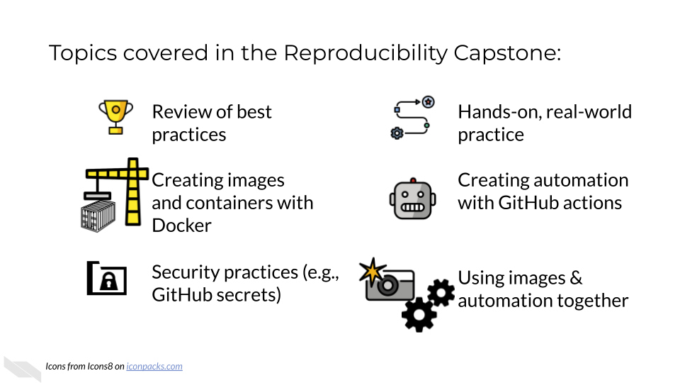

# Introduction

## Motivation

Cancer research in the 21st century is increasingly data-driven, with researchers generating and analyzing vast amounts of genomic, proteomic, imaging, and clinical data. The ability to effectively manage, analyze, and share these complex datasets has become as crucial as traditional laboratory skills. However, many cancer researchers find themselves working with computational tools and workflows that were developed in isolation, making it difficult to reproduce results, collaborate effectively, or scale their analyses.

The modern cancer informatics landscape demands not just analytical skills, but also proficiency in reproducible computational practices. Research has shown that computational analyses are often difficult or impossible to reproduce without direct contact with the original researchers [@BeaulieuJones2017]. This reproducibility crisis extends beyond academic concerns—it directly impacts the translation of research findings into clinical applications and the overall efficiency of cancer research efforts.

## Target Audience

The course is intended for cancer researchers, bioinformaticians, and data scientists who work with computational analyses in cancer research contexts and want to enhance the reproducibility, efficiency, and shareability of their work.

This capstone course builds on foundational concepts from the ITCR Training Network's [Reproducibility in Cancer Informatics](https://jhudatascience.org/Reproducibility_in_Cancer_Informatics/introduction.html), [Advanced Reproducibility in Cancer Informatics](https://jhudatascience.org/Adv_Reproducibility_in_Cancer_Informatics/introduction.html), [Containers for Scientists](https://hutchdatascience.org/Containers_for_Scientists/), and [GitHub Automation for Scientists](https://hutchdatascience.org/GitHub_Automation_for_Scientists/) courses. Students should be comfortable with basic GitHub operations, including creating repositories, making commits, and opening pull requests before beginning this capstone.

_This capstone course is written for individuals who:_

- Conduct computational analyses for cancer research, including genomics, proteomics, imaging, or clinical data analysis.
- Have completed the ITN reproducibility courses mentioned above
- Want to put the reproducibility skill sets together and get more practice in doing this in a “real world” setting.

## Curriculum

The course covers practical application of containerization and automation technologies specifically tailored for cancer informatics workflows. Unlike introductory courses that focus on individual concepts, this capstone emphasizes integration and real-world application of multiple technologies working together.

## Objectives

**Assessment Approach:**

The capstone uses a practical, project-based assessment model where students work with a provided computational sandbox environment to complete real-world tasks. Rather than traditional exams, students demonstrate mastery by successfully implementing containerized workflows and automated pipelines that pass automated evaluation criteria.

**Custom Container Development Assignment** - Students create Docker containers to support specific cancer analysis requirements, demonstrating understanding of containerization principles and bioinformatics software management.

**Working with GitHub Secrets Assignment** -- Students create a personal access token, store the token as a GitHub secret in a repository and access that secret in a GitHub Actions workflow, displaying application of best practices in security when handling sensitive information.

**Automated Workflow Implementation Assignment** - Students create GitHub Actions that automatically execute and validate cancer data analysis pipelines, showing proficiency in continuous integration concepts and workflow automation.

Each assignment utilizes automated evaluation systems that provide immediate feedback and validation codes upon successful completion, simulating real-world development environments where code must pass automated testing before deployment.

**Goal of this course:**
Enable cancer researchers to create, maintain, and share reproducible computational workflows that meet the evolving standards of modern cancer informatics while enhancing collaboration and accelerating scientific discovery.

**What is not the goal:**
This course does not aim to teach cancer biology, statistical analysis methods, or introductory programming concepts. Students are expected to bring domain expertise and basic computational skills to the course, focusing instead on learning to apply advanced reproducibility technologies to their existing research workflows.

## How to use the course

This capstone course is designed as a hands-on, practical experience that builds directly on the foundational knowledge from previous ITCR Training Network courses. Students should approach the course with an active learning mindset, ready to experiment, troubleshoot, and iterate on their solutions.

**Working with the Course Sandbox:**
The course utilizes a GitHub-based sandbox environment that simulates real-world research collaboration workflows. Students will work with the template repository, create branches for different assignments, and receive automated feedback through pull request evaluations. This approach mirrors modern software development practices and prepares students for collaborative research environments.

**Integration Focus:**
Each assignment builds on previous work and integrates multiple technologies. Students should be prepared to synthesize knowledge from containerization, automation, version control, and domain-specific cancer informatics concepts. The goal is to create holistic solutions rather than demonstrate isolated technical skills.

**Real-world Application:**
Throughout the course, students are encouraged to consider how the techniques they're learning apply to their own research contexts. The assignments use cancer informatics examples, but the principles and technologies transfer to a wide range of computational research domains.

We also recommend that students leverage the [broader ITCR Training Network community and resources](https://www.itcrtraining.org/) to enhance their learning experience and build lasting professional connections in the cancer informatics community.

## Where do you need to invest?

This course is to help you apply what we have learned in the previous courses to a real world application. What you build in this capstone is completely up to you, but for your own benefit we suggest you try to make something you will use in your work beyond this specialization.

Think about work on GitHub that you are doing manually, or a project where you are struggling to easily reproduce the results. Those may be ripe opportunities for you to build something. However, keep in mind that it's OK to start small and build up to these goals as you learn.

Use a few minutes for introspective reflection about where you are spending a lot of time and effort to reproduce something that could use some reproducibility investment (like a Github Action or Docker image). Consider attempting to develop such reproducibility investments for these projects in your upcoming assignments.
