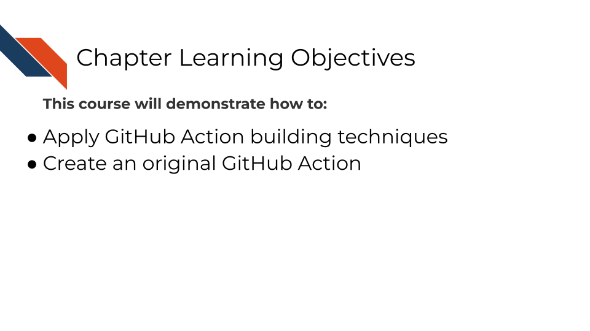
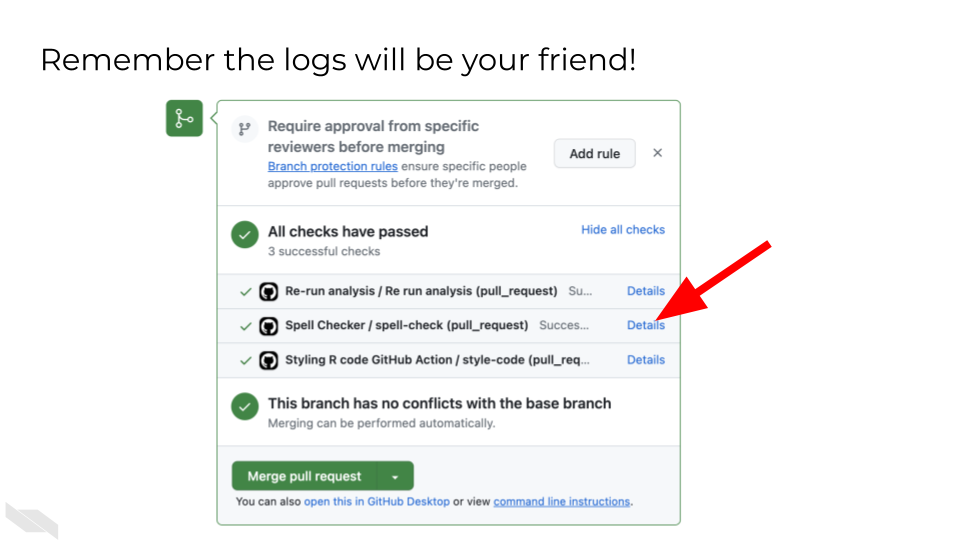

# Building a GitHub Action




## Phase 1: Repository Setup and Planning

### Step 1: Set Up Your Working Environment

<input type="checkbox"> Navigate to your capstone sandbox repository <br/>
<input type="checkbox"> Locate the `GitHub_Action_Assignment.yml` file within the `GitHub_Action_Assignment` directory - this is your starting template <br/>
<input type="checkbox"> Review the existing template to understand what's already provided <br/>

::: {.warning}
**Important:** Do not change the filename from `GitHub_Action_Assignment.yml`. Leave the name exactly as it is. You will be moving the file's location, but do not change its name.
:::

### Step 2: Create Your Working Branch

In order to isolate your work and enable the automated evaluation system this sandbox uses, you will create a new working branch.

<input type="checkbox"> Create a new branch for this assignment (e.g., `github-action-assignment` or `gha-build`)<br/>
<input type="checkbox"> Switch to this branch before making any changes<br/>


### Step 3: Move File to Correct Location

GitHub Actions must be in the `.github/workflows/` directory for Github to recognize them as a GitHub Action

<input type="checkbox"> Move `GitHub_Action_Assignment.yml` to `.github/workflows/GitHub_Action_Assignment.yml` <br/>

::: {.warning}
**Critical:** The file must be in this exact location for GitHub to recognize it as a workflow file (and for this assignment to automatically evaluate your GitHub Action).
:::

### Step 4: Plan Your GitHub Action

While learning, it can be really helpful to pick an action that produces something that you can visually inspect (e.g., a report or plot) because if it is generated and looks how you expect, you can confirm that your GitHub Action is successful and doesn't have a silent failure occurring in the background.

<input type="checkbox"> Decide what useful task your GitHub Action will perform <br/>
- Ideas for useful actions:<br/>
  &nbsp;&nbsp;&nbsp;&nbsp;<input type="checkbox"> Run automated tests on your capstone code<br/>
  &nbsp;&nbsp;&nbsp;&nbsp;<input type="checkbox"> Generate reports or documentation<br/>
  &nbsp;&nbsp;&nbsp;&nbsp;<input type="checkbox"> Check code quality or formatting<br/>
  &nbsp;&nbsp;&nbsp;&nbsp;<input type="checkbox"> Create data visualizations<br/>
  &nbsp;&nbsp;&nbsp;&nbsp;<input type="checkbox"> Send notifications when certain conditions are met<br/>
  &nbsp;&nbsp;&nbsp;&nbsp;<input type="checkbox"> Validate data files or configurations<br/>

::: {.warning}
You **never** want to put sensitive [PHI](https://hutchdatascience.org/Ethical_Data_Handling_for_Cancer_Research/no_toc/data-privacy.html#phi-protected-health-information) or [PII](https://hutchdatascience.org/Ethical_Data_Handling_for_Cancer_Research/no_toc/data-privacy.html#pii-personal-identifiable-information) on GitHub, even in a private repository.
:::

::: {.notice}
You will want to limit the size of any data files you are putting on GitHub unless you have large file storage (GitLFS) capabilities. So if you want to run a report, create a visualization, or validate a data file, then perhaps make a small toy dataset.
:::

## Phase 2: GitHub Action Development

### Step 5: Understand the Template Structure

<input type="checkbox"> Open `GitHub_Action_Assignment.yml` and examine the existing structure <br/>
<input type="checkbox"> Identify the key components: <br/>
  &nbsp;&nbsp;&nbsp;&nbsp;<input type="checkbox"> `name:` - What your action is called <br/>
  &nbsp;&nbsp;&nbsp;&nbsp;<input type="checkbox"> `on:` - When it should trigger <br/>
  &nbsp;&nbsp;&nbsp;&nbsp;<input type="checkbox"> `jobs:` - What it should do <br/>
  &nbsp;&nbsp;&nbsp;&nbsp;<input type="checkbox"> `job-name:` - an identifier of the job specifically <br/>
  &nbsp;&nbsp;&nbsp;&nbsp;<input type="checkbox"> `runs-on:` - What environment to use <br/>

### Step 6: Define Your Action's Purpose

 <input type="checkbox"> Choose a meaningful trigger (`on:`):<br/>
  &nbsp;&nbsp;&nbsp;&nbsp;<input type="checkbox"> `pull_request:` - Runs when PRs are opened/updated (good for testing)<br/>
  &nbsp;&nbsp;&nbsp;&nbsp;<input type="checkbox"> `push:` - Runs when code is pushed to specific branches<br/>
  &nbsp;&nbsp;&nbsp;&nbsp;<input type="checkbox"> `workflow_dispatch:` - Allows manual triggering (useful for development)<br/>
  &nbsp;&nbsp;&nbsp;&nbsp;<input type="checkbox"> `schedule:` - Runs on a time schedule (e.g., once a week)<br/>

 <input type="checkbox"> Design your job steps:<br/>
  &nbsp;&nbsp;&nbsp;&nbsp;<input type="checkbox"> Start with `actions/checkout@v4` to get your repository files<br/>
  &nbsp;&nbsp;&nbsp;&nbsp;<input type="checkbox"> Add steps that accomplish your chosen task<br/>
  &nbsp;&nbsp;&nbsp;&nbsp;<input type="checkbox"> Include error handling and status checks<br/>
  &nbsp;&nbsp;&nbsp;&nbsp;<input type="checkbox"> It's important to name steps so that you can access and check outputs of those steps.<br/>

<input type="checkbox"> Consider and possibly emulate one of these common design strategies for various tasks. Notice how they fill out the key components and outline where the task steps will be filled in:<br/>

<div class="click_to_expand_block">
<details><summary> For Code Quality/Testing:</summary>

```yaml
name: Code Quality Check
on: pull_request
jobs:
  quality-check:
    runs-on: ubuntu-latest
    steps:
      - uses: actions/checkout@v4
      - name: Run quality checks
        run: |
          # Your quality check commands here
          echo "Running code quality checks..."
```

</details>
</div>

<div class="click_to_expand_block">
<details><summary> For Data Analysis:</summary>

```yaml
name: Automated Analysis
on: workflow_dispatch
jobs:
  analyze:
    runs-on: ubuntu-latest
    container:
      image: jhudsl/ottr_python:main  # Example with R and Python
    steps:
      - uses: actions/checkout@v4
      - name: Run analysis
        run: |
          # Your analysis commands here
```

</details>
</div>

<div class="click_to_expand_block">
<details><summary> For Documentation:</summary>
```yaml
name: Generate Documentation
on: push
jobs:
  docs:
    runs-on: ubuntu-latest
    steps:
      - uses: actions/checkout@v4
      - name: Generate docs
        run: |
          # Documentation generation commands
```

</details>
</div>

<input type="checkbox"> Fill out the `GitHub_Action_Assignment.yml`, including the key components, and the steps of the action (the task you chose), under `run: |`.<br/>
<input type="checkbox"> While on your branch, add any needed files (e.g., scripts or toy data) to your copy of the sandbox repository so that your GitHub Action can access them.<br/>

## Phase 3: Testing and Iteration

### Step 7: Open Your Pull Request

Key: This step triggers the `GHA Assignment Eval` test

<input type="checkbox"> Commit your changes to your branch. <br/>
<input type="checkbox"> Push the branch to GitHub. <br/>
<input type="checkbox"> Open a pull request from your branch to main. <br/>

### Step 8: Monitor Automated Evaluation & Interpret Evaluation Results

<input type="checkbox"> Watch for the `GHA Assignment Eval` check to start running <br/>
<input type="checkbox"> This evaluator will test whether your GitHub Action runs successfully. The evaluator checks for common issues and provides guidance. <br/>
<input type="checkbox"> Wait for it to complete and comment on your PR<br/>
  &nbsp;&nbsp;&nbsp;&nbsp; • Success: You'll receive a validation code in the PR comment <br/>
  &nbsp;&nbsp;&nbsp;&nbsp; • Failure: You'll get specific error messages and troubleshooting tips <br/>
<input type="checkbox"> Interpret the results and proceed accordingly:<br/>
  &nbsp;&nbsp;&nbsp;&nbsp; <input type="checkbox"> If the test's comment provides a validation code, skip to Phase 5.<br/>
  &nbsp;&nbsp;&nbsp;&nbsp; <input type="checkbox"> If the test's comment contains error messages, visit Phase 4: Troubleshooting and Refinement of these instructions.<br/>

## Phase 4: Troubleshooting and Refinement

### Step 9: Debug Common Issues

Common issues to check: <br/>
<input type="checkbox"> YAML syntax errors: Check indentation, colons, and spacing<br/>
<input type="checkbox"> File location errors: Ensure file is in `.github/workflows/`<br/>
<input type="checkbox"> Permission errors: May need to add GitHub secrets or tokens (see the GitHub Secrets Assignment for more information if necessary)<br/>
<input type="checkbox"> Missing dependencies: Check if your chosen environment has required software<br/>
<input type="checkbox"> Silent failures: Verify your action actually does what you expect<br/>


You'll find specific error messages in the actions logs. Check them out!



### Step 10: Iterate Until Success

<input type="checkbox"> Make changes to your `GitHub_Action_Assignment.yml` file on your branch<br/>
<input type="checkbox"> Commit and push changes to trigger new evaluation runs<br/>
<input type="checkbox"> Keep refining based on feedback until you get an action that runs successfully<br/>


## Phase 6: Completion

:::{.certificate}

If you are taking the course on Coursera:


**Collect Your Validation Code**

<input type="checkbox"> Once your GitHub Action runs successfully, copy the validation code from the PR comment. Keep this code safe for your quiz submission.<br/>

**Submit Your Quiz**

<input type="checkbox"> Go to your Coursera Graded Assignment ("Building a GitHub Action")<br/>
<input type="checkbox"> Paste the validation code when prompted<br/>
<input type="checkbox"> Submit the quiz to get credit for your work<br/>

<div class = 'iconstyle'>icons from [icons8](https://icons8.com/) </div>

:::

## Suggestions for Troubleshooting and Best Practices

Remember: This assignment builds on both the containers knowledge (for choosing appropriate environments) and the GitHub Actions automation concepts. The goal is to demonstrate your understanding of continuous integration principles by creating something that automatically improves or validates your capstone project.

### Start Simple and Build Up

- Begin with a basic action that you know will work
- Your action should be useful but not overly complex. Focus on demonstrating GitHub Actions concepts rather than building production software.
- Test early and often to catch issues quickly
- Add complexity gradually, testing each addition
- Use marketplace actions: Leverage existing actions when possible

### Use Course Knowledge

- Reference information from the [GitHub Automation for Scientists course](https://hutchdatascience.org/GitHub_Automation_for_Scientists/) as needed.
- Reference YAML examples from course exercises
- Apply containers knowledge:
  - Choose appropriate `runs-on:` environment
  - Consider using Docker containers if you need specific software
  - Reference container images from Docker Hub if needed
- Apply automation principles:
  - Ensure your action fails appropriately when something goes wrong
  - Include meaningful output and logging
  - Use environment variables and [secrets](https://docs.github.com/en/actions/security-for-github-actions/security-guides/using-secrets-in-github-actions#using-secrets-in-a-workflow) when needed. (Remember you may need to add the "workflow" scope to your personal access token for this assignment.)

### Leverage the Automated Testing

- The automated evaluator provides immediate feedback
- Don't be afraid to make multiple attempts - each iteration teaches you something
- Read the evaluator's comments carefully for specific guidance

### Read Error Messages Carefully

- Error messages (in the actions logs) often contain the exact solution
- Check the logs: Go to Actions tab and examine detailed output
- Print debugging info: Use `echo` commands to verify assumptions
- Google specific error messages if they're unclear
- Copy and paste the error code and include any relevant context to a [code trained LLM](https://doi-org.fhcrc.idm.oclc.org/10.1038/d41586-023-03023-4) (e.g., [Phind](https://www.phind.com/)) for additional help.

The automated evaluation system is designed to help you learn through iteration, so embrace the feedback loop and keep refining your action until it works reliably!
